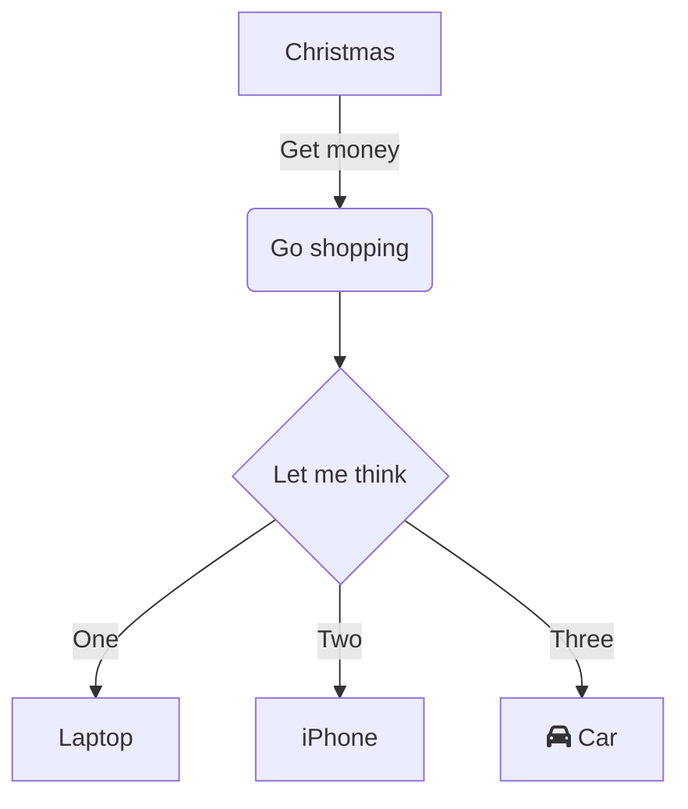
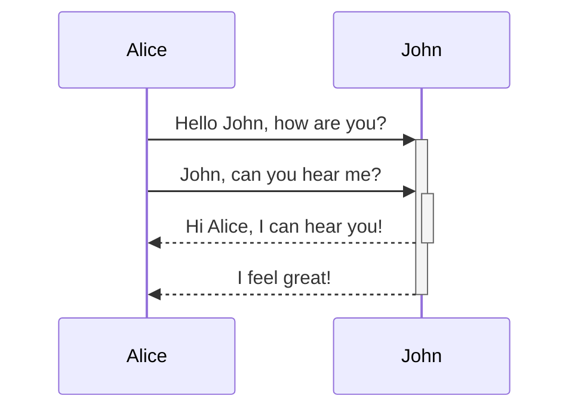

# mermaid_project

## Github repository

https://github.com/mermaid-js/mermaid

## Mermaid
Diagramming and charting tool

JavaScript based diagramming and charting tool that renders Markdown-inspired text definitions to create and modify diagrams dynamically.

https://mermaid.js.org/

## Mermaid Live Editor

https://mermaid.live/edit


## Flow(Sample Code)




```
```mermaid
graph TD
    A[Christmas] -->|Get money| B(Go shopping)
    B --> C{Let me think}
    C -->|One| D[Laptop]
    C -->|Two| E[iPhone]
    C -->|Three| F[fa:fa-car Car]
  
"```
```


<br>

## Sequence(Sample code)




```
```mermaid

sequenceDiagram
    Alice->>+John: Hello John, how are you?
    Alice->>+John: John, can you hear me?
    John-->>-Alice: Hi Alice, I can hear you!
    John-->>-Alice: I feel great!
"```
```

<hr>