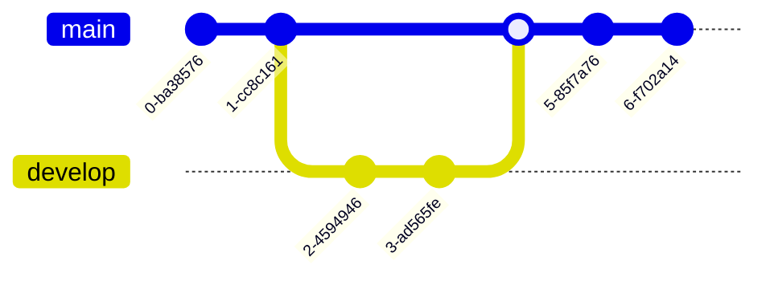

# mermaid_project

## Visual Studio Code Extension(VSCode Extension)

https://marketplace.visualstudio.com/items?itemName=bierner.markdown-mermaid

## Github repository

https://github.com/mermaid-js/mermaid

## Mermaid
Diagramming and charting tool

JavaScript based diagramming and charting tool that renders Markdown-inspired text definitions to create and modify diagrams dynamically.

https://mermaid.js.org/

## Mermaid Live Editor

https://mermaid.live/edit


## Flow(Sample Code)


```
```mermaid
graph TD
    A[Christmas] -->|Get money| B(Go shopping)
    B --> C{Let me think}
    C -->|One| D[Laptop]
    C -->|Two| E[iPhone]
    C -->|Three| F[fa:fa-car Car]
  
"```
```


<br>

<hr>

## Sequence(Sample code)


```
```mermaid

sequenceDiagram
    Alice->>+John: Hello John, how are you?
    Alice->>+John: John, can you hear me?
    John-->>-Alice: Hi Alice, I can hear you!
    John-->>-Alice: I feel great!
"```
```

<br>

<hr>


## Class(Sample code)


```
```mermaid


classDiagram
    Animal <|-- Duck
    Animal <|-- Fish
    Animal <|-- Zebra
    Animal : +int age
    Animal : +String gender
    Animal: +isMammal()
    Animal: +mate()
    class Duck{
      +String beakColor
      +swim()
      +quack()
    }
    class Fish{
      -int sizeInFeet
      -canEat()
    }
    class Zebra{
      +bool is_wild
      +run()
    }

"```
```

<br>

<hr>

## State(Sample code)


```


<br>

<hr>

## ER(erDiagram)(Sample code)


```
```mermaid
erDiagram
    CUSTOMER }|..|{ DELIVERY-ADDRESS : has
    CUSTOMER ||--o{ ORDER : places
    CUSTOMER ||--o{ INVOICE : "liable for"
    DELIVERY-ADDRESS ||--o{ ORDER : receives
    INVOICE ||--|{ ORDER : covers
    ORDER ||--|{ ORDER-ITEM : includes
    PRODUCT-CATEGORY ||--|{ PRODUCT : contains
    PRODUCT ||--o{ ORDER-ITEM : "ordered in"
"```
```

<br>

<hr>

## Gantt(Sample code)


```
```mermaid

    title A Gantt Diagram
    dateFormat  YYYY-MM-DD
    section Section
    A task           :a1, 2014-01-01, 30d
    Another task     :after a1  , 20d
    section Another
    Task in sec      :2014-01-12  , 12d
    another task      : 24d

"```
```

<br>

<hr>

## User Journey(Sample Code)


```
```mermaid
journey
    title My working day
    section Go to work
      Make tea: 5: Me
      Go upstairs: 3: Me
      Do work: 1: Me, Cat
    section Go home
      Go downstairs: 5: Me
      Sit down: 3: Me

"```
```


<br>

<hr>

## Git



```


## Pie (Sample Code)


```


<br>

<hr>
